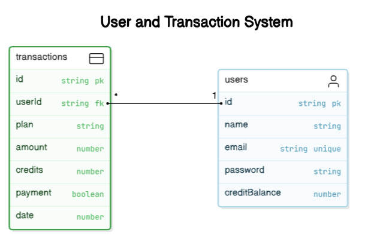
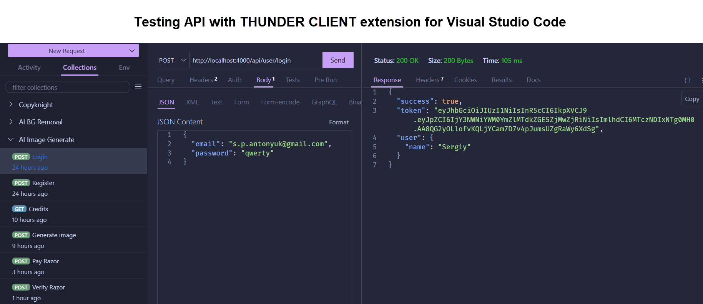

## Text to image with AI 

<!-- [SITE](https://erase-bg-sxidsvit.vercel.app/) -->
<a href="https://erase-bg-sxidsvit.vercel.app/" target="_blank">CITE</a>


### Core Application Idea 
The  site is designed to automatically remove background from images. The /remove-bg API route, which is used for image processing and background removal. The site provides a simple to use web interface where the user can upload an image and then get a version without background.

---

<!-- 
 -->

---

### Basic features
#### 1. Frontend (client part):
- Based on React.js using React Router for routing.
- Uses Tailwind CSS for styling.
- AXIOS is used to send HTTP requests.
- Designed with the Vite Collector, which speeds up development and improves performance.

#### 2. Backend (server part):
- Works on Node.js using Express.
- For data storage MongoDB is used.
- Integration with Razorpay and Stripe payment systems to provide paid services (for example, adding credits for image processing).
- Authentication and authorization are performed via JSON Web Token.
- Integration of a third-party API for image processing (e.g., CLIPDROP API).


#### 3. Main API routes:

##### User Router:
- Processing payments via Razorpay and Stripe.
- Check user credit.

##### Image Router:
- text to image generate via /api/image/generate-image API.

#### 4. Configuration via . env:

- Environment variables contain API keys and configuration settings for the client and server.

---

### Tech Stack

- Client:  React.js 18,  React Router 6,  Tailwind CSS,  AXIOS,  VITE

- Server: NODE,  EXPRESS,  MONGODB,  AXIOS,  RAZORPAY,  STRIPE, JSON WEB TOKEN,  FORM DATA, BCRYPT



---

### Routing

``` js 
User Router:
userRouter.post('/register', registerUser)
userRouter.post('/login', loginUser)
userRouter.get('/credits', authUser, userCredits)
userRouter.post('/pay-razor', authUser, paymentRazorpay)
userRouter.post('/verify-razor', verifyRazorpay)
userRouter.post('/pay-stripe', authUser, paymentStripe)
userRouter.post('/verify-stripe', authUser, verifyStripe)

Image Router:
imageRouter.post('/generate-image', authUser, generateImage)

```


---

### .env 

``` js 
Client: 
VITE_BACKEND_URL = 
VITE_RAZORPAY_KEY_ID = 

Server: 
JWT_SECRET =
MONGODB_URI = 
CLIPDROP_API = 
CURRENCY =
RAZORPAY_KEY_ID = 
RAZORPAY_KEY_SECRET = 
STRIPE_SECRET_KEY=
```


---

##### Contact with me:

[][linkedin]

[linkedin]: https://www.linkedin.com/in/sergiy-antonyuk/


##### I can't express how much I have learned from [you](https://www.youtube.com/@GreatStackDev) ! <br> Thanks for the hard and smart work.
